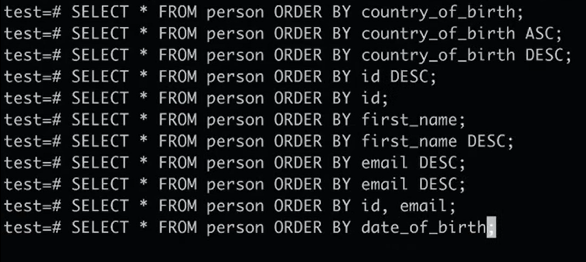

# PostgreSQL-Notes
My personal notes for PostgreSQL.

- **\l**: lists all dbs
- **\c [db_name]**: connects to the database
- **\dt**: lists all tables
- **\d [table_name]**: lists entities in the table
- **\i C:/Users/Dincer/Desktop/PostgreSQL_DBs/person.sql** : to load from the text file
#
- **DROP TABLE [table_name];** deletes the table
- **SELECT * FROM person;**: select all columns values in the table
- **SELECT first_name, last_name FROM person;**: Select all columns values in the table
#
### ORDER BY
- **SELECT * FROM person ORDER BY country_of_birth ASC;** : A->Z

- **SELECT * FROM person ORDER BY id ASC;**: 1234567...

#
### DISTINCT
- SELECT **DISTINCT** country_of_birth FROM person ORDER BY country_of_birth ASC;
- SELECT **DISTINCT** country_of_birth FROM person ORDER BY country_of_birth DESC;
#
### WHERE
- SELECT * FROM person WHERE gender='Female';
- SELECT * FROM person WHERE gender='Male' AND country_of_birth='Turkey'
- SELECT * FROM person WHERE gender='Male' AND (country_of_birth='Turkey' OR country_of_birth='USA') AND last_name = "Pete";
#
### COMPARISON OPERATORS
SELECT 1 = 1; // t Equals ✅
SELECT 1 <> 1; // f Not equals ❌

SELECT 'AMIGOSCODE' <> 'amigoscode' // t
#
### LIMIT
SELECT * FROM person **LIMIT** 10; // sadece ilk 10 veriyi getirir.
SELECT * FROM person **OFFSET** 10 **LIMIT** 10; // sadece 10-20 arası veriyi getirir.

SELECT * FROM person OFFSET 10 FETCH FIRST 10 ROW ONLY; // aynısı
#
### IN
SELECT * FROM person WHERE country_of_birth ='China' OR country_of_birth ='Brazil' OR country_of_birth ='France';

 SELECT * FROM person WHERE country_of_birth IN('China','Brazil','France') // aynısı
#
### BETWEEN
SELECT * FROM person WHERE date_of_birth BETWEEN DATE '2000-01-01' AND '2015-01-01'

#
### LIKE
SELECT * FROM person WHERE email LIKE '%@bloomberg.com';
SELECT * FROM person WHERE email LIKE '%@google.';

1:41:55:https://www.youtube.com/watch?v=qw--VYLpxG4&t=275s&ab_channel=freeCodeCamp.org
